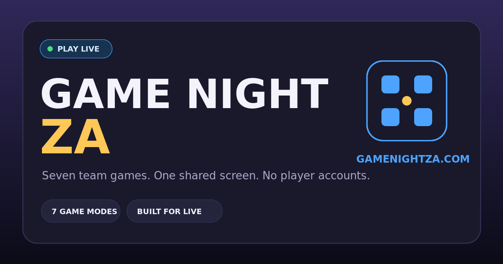

# Game Night ZA



A host-controlled party-game platform built for TikTok Live and other shared-screen game nights. One host opens the site, shares the same browser window and runs the entire game while players participate through the livestream.

**Live application:** [gamenightza.com](https://gamenightza.com)  
**Source:** [github.com/LARSENZA/game-night-live](https://github.com/LARSENZA/game-night-live)

## Highlights

- Guest-first gameplay: players do not need accounts or devices
- Single-screen stream mode with fullscreen and hideable host controls
- Two teams with editable names, direct score entry and ±5 controls
- Seven game modes: Spelling Bee, Taboo, Music Round, Password, Bomb, Fifth Grader and Wavelength
- Room codes and host-token authorization
- Persistent Cloudflare D1 content database
- Custom question editor with CSV and JSON importing
- Question rotation that prevents repeats between teams until the available bank is exhausted
- Optional second display for multi-monitor setups
- Responsive landscape layout for TikTok Live Studio, desktop and mobile

## Game Modes

| Mode         | How it works                                                                           |
| ------------ | -------------------------------------------------------------------------------------- |
| Spelling Bee | Spell the displayed word correctly before moving to the next prompt.                   |
| Taboo        | Describe the target without using any of the forbidden words.                          |
| Music Round  | The host awards points for identifying the title, artist and lyrics.                   |
| Password     | Three clues are entered and hidden one at a time, then revealed together for Player 4. |
| Bomb         | Players answer around the active letter rule before the hidden fuse expires.           |
| Fifth Grader | General-knowledge questions with host-controlled answer reveals.                       |
| Wavelength   | Teams estimate a hidden target on a 0–10 scale during a 60-second timed round.         |

## Technology

| Layer                 | Technology                                             |
| --------------------- | ------------------------------------------------------ |
| Interface             | React 19, TypeScript, CSS                              |
| Application framework | Next.js App Router API surface through Vinext and Vite |
| Server runtime        | Cloudflare Workers                                     |
| Database              | Cloudflare D1 (SQLite)                                 |
| ORM and migrations    | Drizzle ORM and Drizzle Kit                            |
| Deployment            | Cloudflare Workers Builds connected to GitHub          |

## Architecture

The host creates a room through the API and receives a private host token stored in that browser. Game actions are authorized by that token and persisted as room state in D1. The host and optional display clients refresh shared room state frequently, while timers use server-generated end timestamps so reconnecting clients calculate the same remaining time.

Default and room-specific questions are stored in D1. Used content IDs are tracked per game and room, preventing Team B from receiving a question already shown to Team A until the eligible question bank has been exhausted.

## Run Locally

### Requirements

- Node.js 22.13 or newer
- npm
- A Cloudflare account for D1-backed features

Clone and install:

```bash
git clone https://github.com/LARSENZA/game-night-live.git
cd game-night-live
npm install
```

Apply the migrations to a local D1 database:

```bash
npx wrangler d1 migrations apply game-night-live-db --local
```

Start the development server:

```bash
npx vite
```

Open the local address printed in the terminal.

## Deploy

Authenticate once:

```bash
npx wrangler login
```

Apply new migrations when the schema changes:

```bash
npx wrangler d1 migrations apply game-night-live-db --remote
```

Deploy manually:

```bash
npm run deploy
```

The production Worker is also connected to the `main` branch through Cloudflare Workers Builds, so accepted pushes automatically deploy.

## Content Management

Create a room, then select **Content** from the host view. The host can:

- Enable or disable built-in questions
- Add room-specific content
- Edit or remove custom entries
- Import multiple entries using CSV or JSON

## Stream Controls

| Key | Action                        |
| --- | ----------------------------- |
| `G` | Open or close the game picker |
| `F` | Enter or exit fullscreen      |
| `H` | Hide or show host controls    |

## Project Status

Game Night ZA is deployed and playable. Current development is focused on additional content, gameplay polish, automated testing and improved deployment previews.

## Author

Built by [Larsen Ngobeni](https://github.com/LARSENZA).
